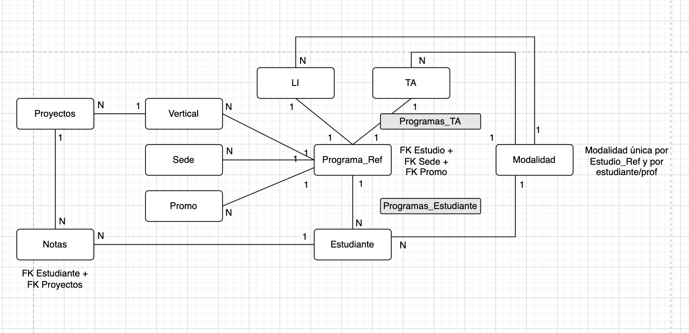
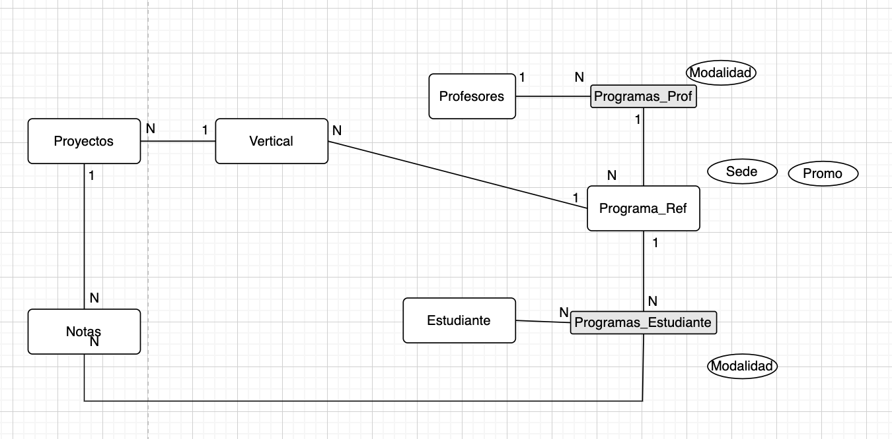
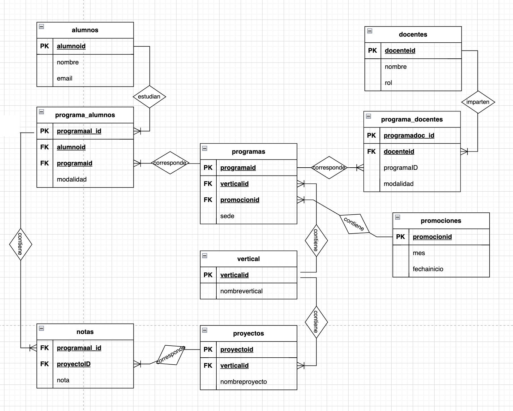
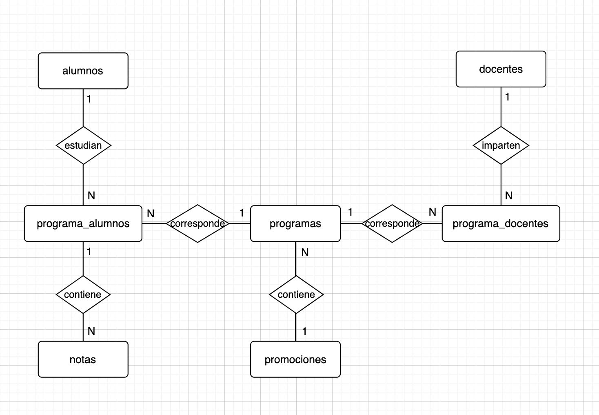
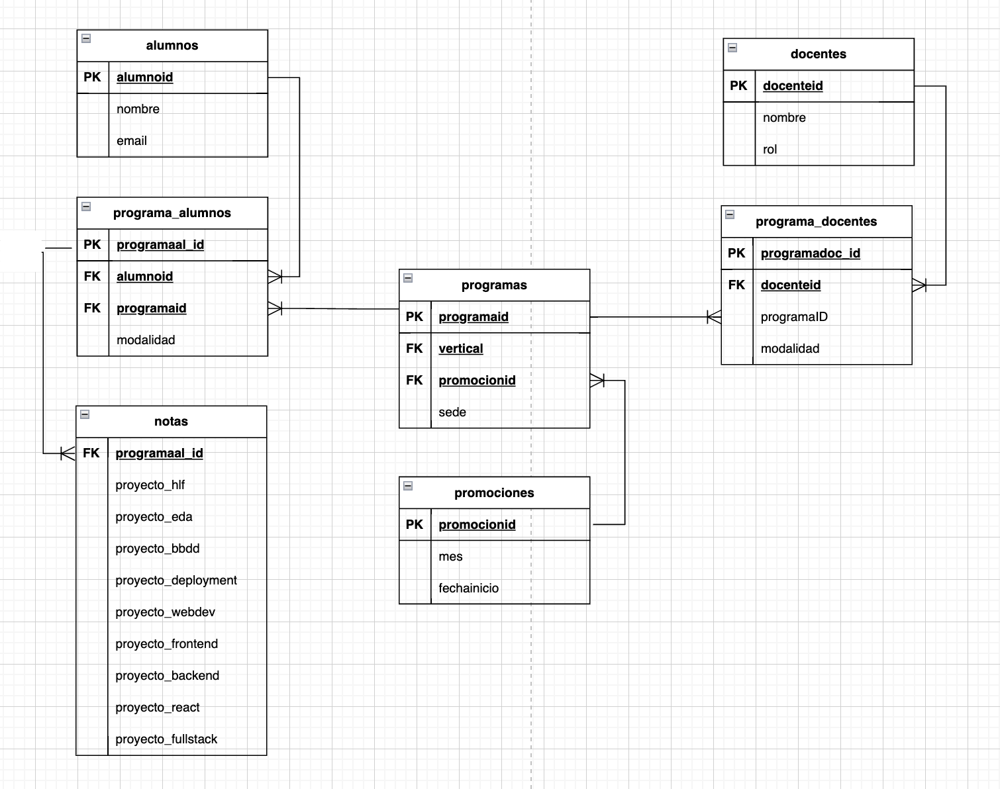

# Proyecto de Base de Datos

## Descripción

Este proyecto consiste en la creación de una base de datos para gestionar información de alumnos, docentes, programas, promociones, proyectos y notas. La estructura de la base de datos está diseñada para soportar la gestión académica y administrativa de una institución educativa.

## Estructura de la Base de Datos

La base de datos está compuesta por las siguientes tablas:

- **alumnos**: Almacena información sobre los alumnos.
- **docentes**: Almacena información sobre los docentes.
- **programas**: Almacena información sobre los programas académicos.
- **promociones**: Almacena información sobre las promociones de los programas.
- **proyectos**: Almacena información sobre los proyectos realizados.
- **notas**: Almacena las notas de los alumnos en los distintos programas.
- **programa_alumnos**: Relaciona los alumnos con los programas en los que están inscritos.
- **programa_docentes**: Relaciona los docentes con los programas en los que enseñan.
- **vertical**: Almacena información sobre las áreas verticales de los programas.

## Descripción de las Tablas

### alumnos
- **alumnoid**: Identificador único del alumno (integer).
- **nombre**: Nombre del alumno (text).
- **email**: Dirección de correo electrónico del alumno (text).

### docentes
- **docenteid**: Identificador único del docente (integer).
- **nombre**: Nombre del docente (text).
- **rol**: Rol del docente en la institución (text).

### programas
- **programaid**: Identificador único del programa (integer).
- **verticalid**: Identificador del área vertical del programa (integer).
- **promocionid**: Identificador de la promoción del programa (integer).
- **sede**: Sede del programa (text).

### promociones
- **promocionid**: Identificador único de la promoción (integer).
- **mes**: Mes de inicio de la promoción (text).
- **fechainicio**: Fecha de inicio de la promoción (text).

### proyectos
- **proyectoid**: Identificador único del proyecto (integer).
- **verticalid**: Identificador del área vertical del proyecto (integer).
- **nombreproyecto**: Nombre del proyecto (text).

### notas
- **programaal_id**: Identificador de la relación programa-alumno (integer).
- **verticalid**: Identificador del área vertical de la nota (integer).
- **proyectoid**: Identificador del proyecto asociado a la nota (integer).
- **nota**: Nota obtenida (text).

### programa_alumnos
- **programaal_id**: Identificador único de la relación programa-alumno (integer).
- **alumnoid**: Identificador del alumno (integer).
- **programaid**: Identificador del programa (integer).
- **modalidad**: Modalidad del programa (text).

### programa_docentes
- **programado_id**: Identificador único de la relación programa-docente (integer).
- **docenteid**: Identificador del docente (integer).
- **programaid**: Identificador del programa (integer).
- **modalidad**: Modalidad del programa (text).

### vertical
- **verticalid**: Identificador único del área vertical (integer).
- **nombrevertical**: Nombre del área vertical (text).

## Diagrama ER

## Contribuciones

Las contribuciones a este proyecto son bienvenidas. Si deseas contribuir, por favor sigue los pasos descritos en el archivo CONTRIBUTING.md.
